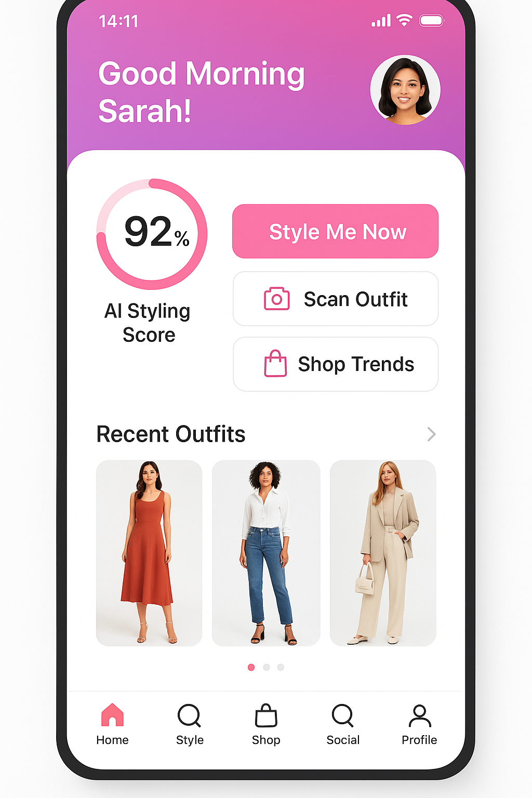
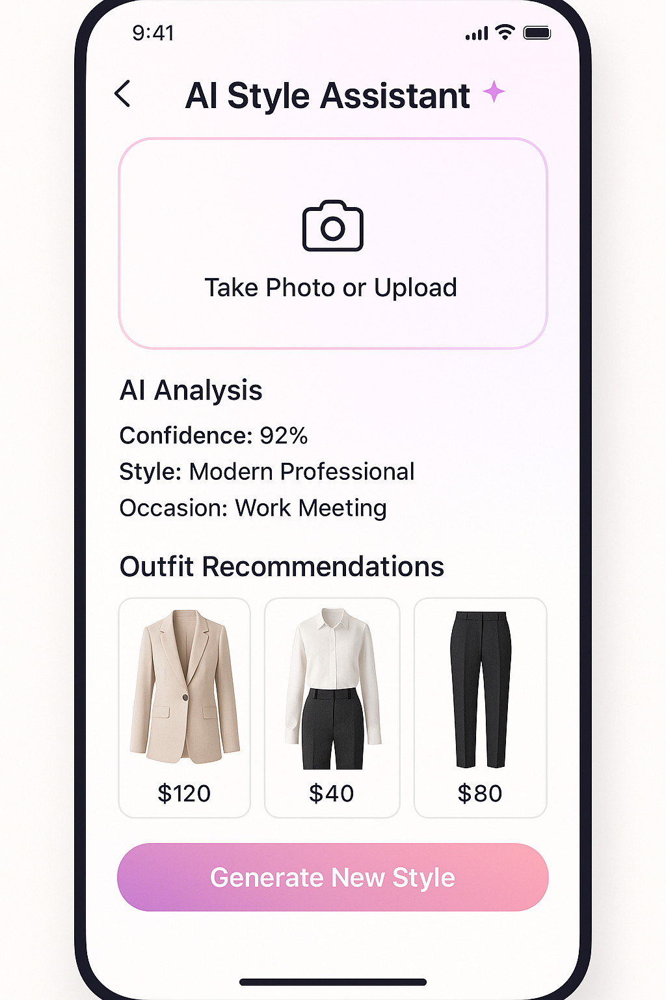
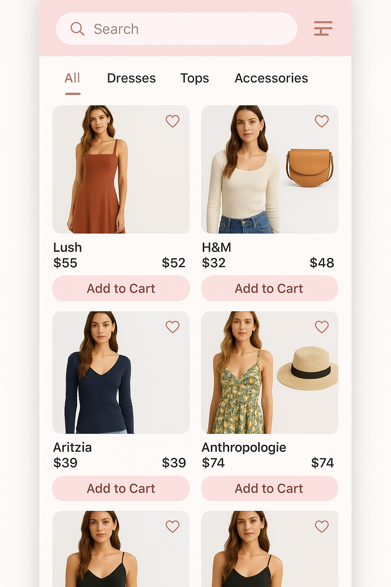
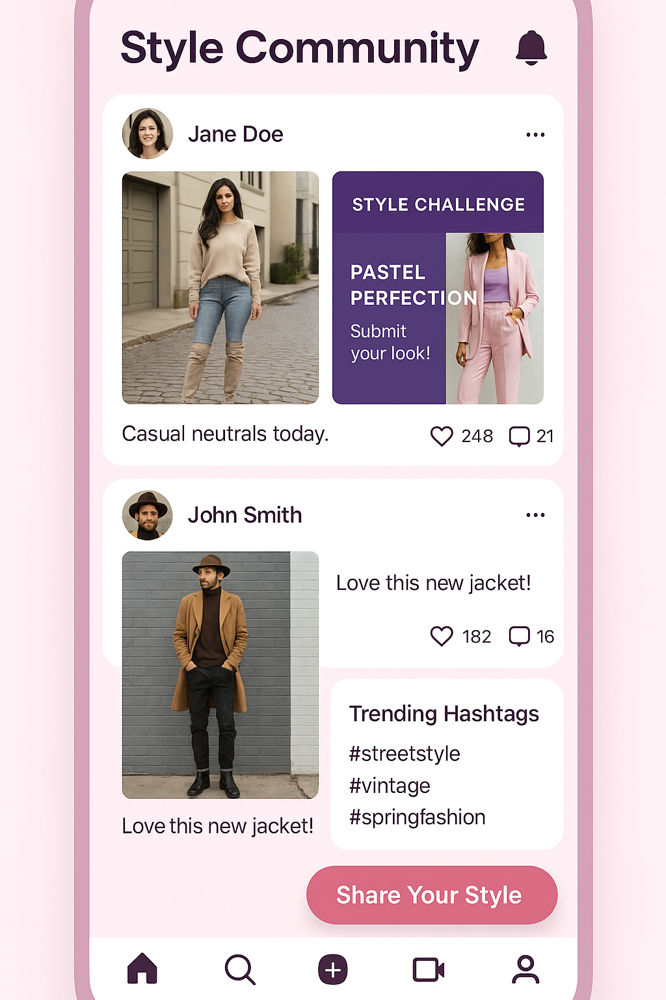

# Tanvi Vanity AI - A/B Testing User Guide

## 🌟 **"We girls have no time"** - The Ultimate Fashion AI Experience

---

### 📱 **Welcome to the Future of Fashion Shopping**

Thank you for participating in the A/B testing of **Tanvi Vanity AI**, the revolutionary fashion app that's transforming how women discover, style, and shop for fashion. This comprehensive guide will help you understand every aspect of the app and provide meaningful feedback that will shape the future of AI-powered fashion.

---

## 🎯 **What is Tanvi Vanity AI?**

**Tanvi Vanity AI** is an intelligent fashion companion that combines artificial intelligence, computer vision, and social commerce to solve the modern woman's biggest challenge: **"We girls have no time"** for complicated fashion decisions.

### **The Core Problem We Solve:**
- ⏰ **Time Constraint**: Busy women don't have hours to browse fashion
- 🤔 **Decision Fatigue**: Too many choices lead to analysis paralysis  
- 💸 **Shopping Mistakes**: Buying items that don't match or suit you
- 📱 **Fragmented Experience**: Jumping between multiple apps for styling, shopping, and inspiration
- 🌍 **Market Complexity**: Different fashion needs across US and India markets

### **Our Solution:**
**Lightning-fast, AI-powered fashion decisions** that get you from inspiration to purchase in under 2 minutes, with 90%+ styling accuracy and personalized recommendations that understand your unique style, body type, and lifestyle.

---

## 🚀 **Key Value Propositions**

### 1. **⚡ Speed & Efficiency**
- **2-minute styling**: From photo to complete outfit recommendation
- **One-tap shopping**: Direct purchase integration with major retailers
- **Instant analysis**: Real-time outfit feedback using computer vision
- **Quick decisions**: AI eliminates choice overload

### 2. **🎯 Personalization at Scale**
- **AI Style Profiling**: Learns your preferences from every interaction
- **Body Type Optimization**: Recommendations tailored to your silhouette
- **Lifestyle Matching**: Outfits that fit your daily activities
- **Budget Awareness**: Suggestions within your spending comfort zone

### 3. **🌍 Multi-Market Intelligence**
- **US Market**: Fast fashion, professional wear, seasonal trends
- **India Market**: Ethnic wear integration, festival collections, value-conscious shopping
- **Cultural Sensitivity**: Understanding regional fashion preferences
- **Local Brand Integration**: Access to both global and regional retailers

### 4. **📸 Computer Vision Magic**
- **Outfit Analysis**: Scan any outfit for instant feedback
- **Wardrobe Management**: Catalog your existing clothes automatically
- **Style Matching**: Find similar items across multiple retailers
- **Color Coordination**: Perfect color palette suggestions

### 5. **👥 Social Commerce**
- **Community Styling**: Get feedback from fashion-forward users
- **Trend Discovery**: See what's popular in your demographic
- **Style Challenges**: Participate in fashion competitions
- **Influencer Integration**: Follow and shop from style icons

---

## 📱 **App Overview & Screenshots**

### **Progressive Web App (PWA) Experience**

Tanvi Vanity AI is delivered as a **Progressive Web App (PWA)**, providing a native app experience without requiring app store downloads. This means:

- **Instant Access**: No app store approval delays
- **Home Screen Installation**: Add to home screen like a native app
- **Offline Functionality**: Core features work without internet
- **Push Notifications**: Real-time engagement and updates
- **Cross-Platform**: Works on iOS, Android, and desktop

*PWA Installation Prompt - Testers can install directly from browser*

---

### **Main App Screens**

#### **1. Home Dashboard**

*Personalized dashboard with AI styling score, quick actions, and recent outfits*

**Key Features:**
- **Personalized Greeting**: "Good Morning Sarah!" with user avatar
- **AI Styling Score**: Real-time confidence rating (92% shown)
- **Quick Actions**: Style Me Now, Scan Outfit, Shop Trends
- **Recent Outfits**: Carousel of previously styled looks
- **Bottom Navigation**: Easy access to all major features

#### **2. AI Style Assistant**

*AI-powered styling with photo analysis and outfit recommendations*

**Key Features:**
- **Photo Upload**: Camera integration for outfit analysis
- **AI Analysis**: Confidence score, style classification, occasion detection
- **Smart Recommendations**: Curated outfit suggestions with pricing
- **Generate New Style**: One-tap to create fresh looks

#### **3. Shopping Experience**

*Integrated e-commerce with AI-powered product discovery*

**Key Features:**
- **Smart Search**: AI-enhanced product discovery
- **Category Filtering**: Dresses, Tops, Accessories organization
- **Brand Integration**: Lush, H&M, Aritzia, Anthropologie partnerships
- **Wishlist Functionality**: Heart icon for saving favorites
- **Direct Purchase**: One-tap add to cart functionality

#### **4. Social Community**

*Fashion community with style challenges and social engagement*

**Key Features:**
- **Style Feed**: Community outfit posts with engagement metrics
- **Style Challenges**: Themed competitions (Pastel Perfection shown)
- **Trending Hashtags**: #streetstyle, #vintage, #springfashion
- **Social Sharing**: Share Your Style floating action button
- **Community Engagement**: Like and comment functionality

---

## 🎯 **Core Features Deep Dive**

### **1. AI Styling Engine (WS2 Integration)**

**What It Does:**
- Analyzes your photos using computer vision
- Generates personalized outfit recommendations
- Learns from your preferences and feedback
- Provides styling confidence scores and reasoning

**Key Capabilities:**
- **Style Classification**: Modern Professional, Casual Chic, Bohemian, etc.
- **Occasion Detection**: Work Meeting, Date Night, Weekend Casual
- **Body Type Optimization**: Recommendations tailored to your silhouette
- **Color Palette Analysis**: Seasonal color matching and coordination
- **Trend Integration**: Current fashion trends incorporated into suggestions

**User Experience:**
1. Take a photo or upload an existing outfit
2. AI analyzes in 2-3 seconds
3. Receive confidence score (typically 85-95%)
4. Get 3-5 outfit recommendations with reasoning
5. One-tap shopping for recommended items

### **2. Computer Vision Wardrobe (WS3 Integration)**

**What It Does:**
- Scans and catalogs your existing wardrobe
- Identifies clothing items, colors, and styles
- Suggests outfit combinations from your closet
- Tracks wear frequency and outfit performance

**Key Capabilities:**
- **Automatic Cataloging**: Photo-based wardrobe inventory
- **Item Recognition**: Identifies specific clothing types and brands
- **Outfit Combination**: Suggests new ways to wear existing pieces
- **Wear Analytics**: Tracks which items you wear most/least
- **Gap Analysis**: Identifies missing pieces in your wardrobe

**User Experience:**
1. Scan individual clothing items or full outfits
2. AI automatically categorizes and tags items
3. Browse your digital wardrobe by category/color/season
4. Get suggestions for new combinations
5. Track outfit performance and wear patterns

### **3. Social Integration (WS4 Integration)**

**What It Does:**
- Connects you with a fashion-forward community
- Enables style sharing and feedback
- Provides trend discovery and inspiration
- Facilitates style challenges and competitions

**Key Capabilities:**
- **Community Feed**: See outfits from users with similar style
- **Style Challenges**: Weekly themed competitions
- **Trend Discovery**: Real-time fashion trend identification
- **Influencer Integration**: Follow and shop from style icons
- **Peer Feedback**: Get styling advice from the community

**User Experience:**
1. Share your outfits with the community
2. Participate in weekly style challenges
3. Discover trending styles and hashtags
4. Follow users with similar taste
5. Get feedback and styling tips from peers

### **4. E-commerce Integration (WS5 Integration)**

**What It Does:**
- Seamlessly integrates shopping with styling
- Provides multi-market support (US & India)
- Enables one-tap purchasing from recommendations
- Offers personalized deals and promotions

**Key Capabilities:**
- **Multi-Market Support**: US (USD) and India (INR) pricing
- **Merchant Integration**: Zara, H&M, Myntra, Amazon Fashion
- **Payment Processing**: Credit cards, PayPal, UPI, Cash on Delivery
- **Smart Recommendations**: AI-powered product suggestions
- **Price Comparison**: Best deals across multiple retailers

**User Experience:**
1. Receive AI styling recommendations
2. See real products with current pricing
3. Compare options across multiple retailers
4. One-tap add to cart and checkout
5. Track orders and delivery status

### **5. User Management (WS1 Integration)**

**What It Does:**
- Manages user profiles and preferences
- Handles authentication and security
- Tracks styling history and analytics
- Provides personalized settings and customization

**Key Capabilities:**
- **Profile Management**: Personal info, style preferences, measurements
- **Preference Learning**: AI learns from your choices and feedback
- **Style History**: Complete record of outfits and purchases
- **Achievement System**: Style milestones and community recognition
- **Privacy Controls**: Granular control over data sharing

**User Experience:**
1. Create profile with style preferences and measurements
2. Set budget ranges and favorite brands
3. Choose privacy settings for social features
4. Track your styling journey and achievements
5. Customize app experience and notifications

---

## 🌍 **Multi-Market Features**

### **US Market Experience**
- **Currency**: USD pricing across all retailers
- **Brands**: Zara, H&M, Nordstrom, Target, Amazon Fashion
- **Payment**: Credit cards, PayPal, Apple Pay, Google Pay
- **Shipping**: Standard (5-7 days), Express (2-3 days), Same-day
- **Style Focus**: Professional wear, fast fashion, seasonal trends
- **Free Shipping**: Orders over $50

### **India Market Experience**
- **Currency**: INR pricing with local market rates
- **Brands**: Myntra, Flipkart Fashion, Ajio, Nykaa Fashion
- **Payment**: UPI, Paytm, Net Banking, Cash on Delivery
- **Shipping**: Standard (3-5 days), Express (1-2 days), Metro same-day
- **Style Focus**: Ethnic wear integration, festival collections, value-conscious
- **Free Shipping**: Orders over ₹999

---

## 🧪 **A/B Testing Objectives**

### **Primary Goals**
1. **User Experience Validation**: How intuitive is the app navigation?
2. **AI Accuracy Assessment**: Are styling recommendations relevant and accurate?
3. **Feature Adoption**: Which features do users engage with most?
4. **Performance Evaluation**: How fast and responsive is the app?
5. **PWA Experience**: How well does the PWA installation and usage work?

### **Secondary Goals**
1. **Social Engagement**: Do users participate in community features?
2. **Shopping Conversion**: Do users complete purchases through the app?
3. **Retention Patterns**: How often do users return to the app?
4. **Cross-Feature Usage**: Do users utilize multiple app features?
5. **Market Preferences**: Differences between US and India user behavior

---

## 🎯 **Detailed Test Scenarios**

### **Scenario 1: Morning Styling Rush**
**Context**: Sarah is a working professional who needs to get dressed quickly for an important meeting.

**User Journey:**
1. **Open App**: Launch Tanvi AI from home screen (PWA)
2. **Quick Style**: Tap "Style Me Now" on home dashboard
3. **Photo Upload**: Take photo of current outfit or upload from gallery
4. **AI Analysis**: Wait for AI analysis (should complete in 2-3 seconds)
5. **Review Recommendations**: Browse 3-5 outfit suggestions
6. **Select & Shop**: Choose preferred outfit and add items to cart
7. **Quick Checkout**: Complete purchase using saved payment method

**Expected Outcome**: Complete styling and shopping in under 2 minutes

**Test Points:**
- ⏱️ **Speed**: Total time from app open to purchase completion
- 🎯 **Accuracy**: Relevance of AI recommendations for work meeting
- 📱 **Usability**: Ease of navigation and photo upload
- 💳 **Conversion**: Success rate of completing purchase

---

### **Scenario 2: Weekend Wardrobe Scan**
**Context**: Emma wants to organize her closet and discover new outfit combinations.

**User Journey:**
1. **Navigate to Camera**: Tap "Scan Outfit" or go to Camera screen
2. **Wardrobe Mode**: Select "Scan Wardrobe" option
3. **Item Scanning**: Photograph 10-15 clothing items individually
4. **AI Cataloging**: Watch AI automatically categorize each item
5. **Browse Digital Closet**: Explore categorized wardrobe
6. **Outfit Suggestions**: Review AI-generated combinations from existing pieces
7. **Save Favorites**: Heart favorite combinations for future reference

**Expected Outcome**: Complete digital wardrobe with 5+ new outfit ideas

**Test Points:**
- 🔍 **Recognition Accuracy**: How well AI identifies clothing items
- 📂 **Organization**: Quality of automatic categorization
- 💡 **Creativity**: Novelty and appeal of suggested combinations
- 💾 **Persistence**: Saved outfits remain accessible across sessions

---

### **Scenario 3: Social Style Challenge**
**Context**: Maya wants to participate in the weekly "Pastel Perfection" style challenge.

**User Journey:**
1. **Social Feed**: Navigate to Social screen
2. **Challenge Discovery**: Find "Pastel Perfection" challenge banner
3. **Challenge Details**: Read challenge requirements and inspiration
4. **Outfit Creation**: Use AI styling to create pastel-themed outfit
5. **Photo Capture**: Take styled photo for submission
6. **Post Sharing**: Share outfit with caption and challenge hashtag
7. **Community Engagement**: Like and comment on other participants' posts

**Expected Outcome**: Successful challenge participation with community engagement

**Test Points:**
- 🎨 **Challenge Clarity**: Understanding of challenge requirements
- 🤝 **Social Features**: Ease of posting and engaging with community
- 📈 **Engagement**: Quality of community interactions
- 🏆 **Motivation**: Desire to participate in future challenges

---

### **Scenario 4: Multi-Market Shopping**
**Context**: Priya (India) and Jessica (US) both need outfits for a virtual work presentation.

**India User Journey (Priya):**
1. **Market Selection**: App automatically detects India location
2. **Style Request**: Request "Professional Video Call" styling
3. **AI Recommendations**: Receive Indo-western outfit suggestions
4. **Brand Options**: See Myntra, Ajio, and Nykaa Fashion options
5. **Price Comparison**: Compare prices in INR across retailers
6. **Payment**: Use UPI payment method
7. **Delivery**: Select Cash on Delivery option

**US User Journey (Jessica):**
1. **Market Selection**: App automatically detects US location
2. **Style Request**: Request "Professional Video Call" styling
3. **AI Recommendations**: Receive business casual suggestions
4. **Brand Options**: See Zara, H&M, and Nordstrom options
5. **Price Comparison**: Compare prices in USD across retailers
6. **Payment**: Use saved credit card
7. **Delivery**: Select express 2-day shipping

**Expected Outcome**: Both users receive culturally appropriate, market-specific recommendations

**Test Points:**
- 🌍 **Localization**: Accuracy of market-specific features
- 💰 **Pricing**: Correct currency and regional pricing
- 🏪 **Merchant Integration**: Availability of local brands
- 💳 **Payment Methods**: Appropriate payment options for each market

---

### **Scenario 5: Outfit Performance Tracking**
**Context**: Lisa wants to understand which outfits work best for different occasions.

**User Journey:**
1. **Profile Analytics**: Navigate to Profile screen analytics section
2. **Outfit History**: Review past 30 days of styled outfits
3. **Performance Metrics**: Check confidence scores and wear frequency
4. **Occasion Analysis**: Filter by work, casual, and social events
5. **Trend Identification**: Identify most successful style patterns
6. **Future Planning**: Use insights to plan upcoming outfits
7. **Style Evolution**: Compare current style to 3 months ago

**Expected Outcome**: Clear insights into personal style patterns and preferences

**Test Points:**
- 📊 **Data Visualization**: Clarity of analytics and charts
- 🎯 **Insight Quality**: Usefulness of style insights
- 📈 **Trend Tracking**: Accuracy of style evolution tracking
- 🔮 **Predictive Value**: Helpfulness for future styling decisions

---

## 🧪 **Specific Test Cases**

### **PWA Installation & Performance**

**Test Case 1: PWA Installation**
- **Objective**: Verify smooth PWA installation process
- **Steps**:
  1. Open app URL in mobile browser
  2. Wait for install prompt to appear (should show within 15 seconds)
  3. Tap "Install" button
  4. Confirm installation
  5. Verify app icon appears on home screen
- **Success Criteria**: Installation completes without errors, app launches from home screen

**Test Case 2: Offline Functionality**
- **Objective**: Test app behavior without internet connection
- **Steps**:
  1. Install PWA and use normally for 5 minutes
  2. Turn off internet connection
  3. Try to access previously viewed content
  4. Attempt to use cached features
  5. Reconnect internet and verify sync
- **Success Criteria**: Core features work offline, data syncs when reconnected

### **AI Styling Accuracy**

**Test Case 3: Style Classification**
- **Objective**: Verify AI correctly identifies different style types
- **Steps**:
  1. Upload 5 different style photos: Professional, Casual, Bohemian, Edgy, Classic
  2. Check AI style classification for each
  3. Verify confidence scores are above 80%
  4. Confirm recommendations match identified style
- **Success Criteria**: 4/5 styles correctly identified with >80% confidence

**Test Case 4: Occasion Detection**
- **Objective**: Test AI's ability to detect appropriate occasions
- **Steps**:
  1. Upload outfits for: Work Meeting, Date Night, Gym, Wedding, Casual Weekend
  2. Check AI occasion detection accuracy
  3. Verify recommendations are occasion-appropriate
  4. Test with ambiguous outfits (could fit multiple occasions)
- **Success Criteria**: Clear occasion identification with appropriate recommendations

### **E-commerce Integration**

**Test Case 5: Shopping Cart Flow**
- **Objective**: Verify complete purchase process
- **Steps**:
  1. Add 3 items to cart from AI recommendations
  2. Navigate to cart and verify items/pricing
  3. Proceed to checkout
  4. Enter shipping address
  5. Select payment method
  6. Complete purchase (use test payment)
- **Success Criteria**: Smooth checkout with order confirmation

**Test Case 6: Multi-Market Pricing**
- **Objective**: Test currency and pricing accuracy
- **Steps**:
  1. Test with US location: verify USD pricing
  2. Test with India location: verify INR pricing
  3. Check same item pricing in both markets
  4. Verify appropriate payment methods appear
  5. Test shipping options for each market
- **Success Criteria**: Accurate market-specific pricing and options

### **Social Features**

**Test Case 7: Community Engagement**
- **Objective**: Test social features and community interaction
- **Steps**:
  1. Create and share outfit post
  2. Add caption and hashtags
  3. Like and comment on other posts
  4. Follow other users
  5. Participate in style challenge
- **Success Criteria**: All social actions work smoothly with real-time updates

**Test Case 8: Content Moderation**
- **Objective**: Verify appropriate content filtering
- **Steps**:
  1. Attempt to post inappropriate content
  2. Use inappropriate language in comments
  3. Test reporting functionality
  4. Verify content guidelines are clear
- **Success Criteria**: Inappropriate content is filtered or flagged

### **Performance & Usability**

**Test Case 9: App Performance**
- **Objective**: Measure app speed and responsiveness
- **Steps**:
  1. Time app launch from home screen
  2. Measure photo upload and AI analysis speed
  3. Test navigation between screens
  4. Monitor battery usage during 30-minute session
  5. Check memory usage and app stability
- **Success Criteria**: App launch <3 seconds, AI analysis <5 seconds, smooth navigation

**Test Case 10: Cross-Device Sync**
- **Objective**: Test data synchronization across devices
- **Steps**:
  1. Create account and add preferences on Device A
  2. Log in to same account on Device B
  3. Verify profile data syncs correctly
  4. Make changes on Device B
  5. Check if changes appear on Device A
- **Success Criteria**: Real-time sync across all devices

---

## 📝 **Feedback Collection Framework**

### **Quantitative Metrics**

**Performance Metrics:**
- App launch time (target: <3 seconds)
- AI analysis speed (target: <5 seconds)
- Page load times (target: <2 seconds)
- Crash rate (target: <1%)
- Battery usage per session

**Engagement Metrics:**
- Session duration (target: >5 minutes)
- Feature adoption rate (target: >60% try AI styling)
- Return user rate (target: >40% return within 7 days)
- Social engagement rate (target: >20% participate in community)
- Purchase conversion rate (target: >15% complete purchase)

**Accuracy Metrics:**
- AI styling confidence scores (target: >85% average)
- Style classification accuracy (target: >80% correct)
- User satisfaction with recommendations (target: >4/5 rating)
- Outfit appropriateness for occasion (target: >90% appropriate)

### **Qualitative Feedback**

**User Experience Questions:**
1. How intuitive did you find the app navigation?
2. Were the AI styling recommendations relevant to your style?
3. How satisfied were you with the shopping experience?
4. Did the social features encourage you to engage with the community?
5. How likely are you to recommend this app to friends?

**Feature-Specific Questions:**
1. **AI Styling**: How accurate were the style suggestions? What would improve them?
2. **Camera Features**: How easy was it to scan outfits and wardrobe items?
3. **Shopping**: How smooth was the purchase process? Any friction points?
4. **Social**: Did you feel motivated to participate in style challenges?
5. **PWA**: How was the installation and app-like experience?

**Open-Ended Feedback:**
- What was your favorite feature and why?
- What frustrated you most about the app?
- What features would you like to see added?
- How does this compare to other fashion apps you've used?
- What would make you use this app daily?

---

## 🎯 **Success Criteria**

### **Primary Success Metrics**

**User Experience:**
- ✅ 90%+ users successfully complete PWA installation
- ✅ 85%+ users rate navigation as "intuitive" or "very intuitive"
- ✅ 80%+ users complete their first AI styling session
- ✅ Average session duration >5 minutes

**AI Performance:**
- ✅ 85%+ average confidence score for AI recommendations
- ✅ 80%+ accuracy in style classification
- ✅ 90%+ users rate recommendations as "relevant" or "very relevant"
- ✅ <5 seconds average AI analysis time

**E-commerce Integration:**
- ✅ 70%+ users add items to cart from AI recommendations
- ✅ 15%+ conversion rate from recommendation to purchase
- ✅ 95%+ successful checkout completion rate
- ✅ Multi-market features work correctly for both US and India

**Social Engagement:**
- ✅ 30%+ users create at least one social post
- ✅ 20%+ users participate in style challenges
- ✅ 50%+ users engage with community content (likes/comments)
- ✅ 25%+ users follow other community members

### **Secondary Success Metrics**

**Technical Performance:**
- ✅ <1% crash rate across all devices
- ✅ <3 seconds app launch time
- ✅ 95%+ feature availability across different browsers
- ✅ Offline functionality works for core features

**Retention & Engagement:**
- ✅ 40%+ users return within 7 days
- ✅ 25%+ users return within 30 days
- ✅ 60%+ users try multiple features during first session
- ✅ 4.0+ average app rating

---

## 🚀 **Getting Started Guide**

### **Step 1: Access the App**
1. **Open Browser**: Use Chrome, Safari, or Firefox on your mobile device
2. **Visit URL**: Navigate to the provided test URL
3. **Install PWA**: When prompted, tap "Install" to add to home screen
4. **Launch**: Open the app from your home screen icon

### **Step 2: Create Your Profile**
1. **Sign Up**: Create account with email and password
2. **Style Preferences**: Select your preferred styles and brands
3. **Measurements**: Add basic measurements for better fit recommendations
4. **Budget Range**: Set your typical shopping budget
5. **Market Selection**: Confirm your location (US or India)

### **Step 3: Explore Core Features**
1. **AI Styling**: Try "Style Me Now" with a photo
2. **Wardrobe Scan**: Use camera to scan some clothing items
3. **Shopping**: Browse products and add items to cart
4. **Social**: Check out the community feed and style challenges
5. **Profile**: Review your style analytics and preferences

### **Step 4: Complete Test Scenarios**
1. **Morning Rush**: Complete the quick styling scenario
2. **Wardrobe Organization**: Scan and organize your closet
3. **Social Participation**: Share an outfit or join a challenge
4. **Shopping Journey**: Complete a purchase (use test payment)
5. **Performance Testing**: Use app for 30+ minutes continuously

### **Step 5: Provide Feedback**
1. **Complete Survey**: Fill out the provided feedback form
2. **Rate Features**: Provide ratings for each major feature
3. **Share Insights**: Describe your overall experience
4. **Suggest Improvements**: Share ideas for enhancements
5. **Bug Reports**: Report any issues or unexpected behavior

---

## 📞 **Support & Contact**

### **Technical Support**
- **Email**: support@tanvivanityai.com
- **Response Time**: Within 24 hours
- **Common Issues**: PWA installation, camera permissions, payment testing

### **Feedback Submission**
- **Survey Link**: [Provided separately]
- **Direct Email**: feedback@tanvivanityai.com
- **Video Feedback**: Record screen while using app (optional)

### **Testing Timeline**
- **Duration**: 2 weeks
- **Minimum Usage**: 5 sessions, 30+ minutes total
- **Feedback Deadline**: [Date provided separately]
- **Results Sharing**: Summary shared with all testers

---

## 🌟 **Thank You**

Thank you for participating in the Tanvi Vanity AI A/B testing program! Your feedback is invaluable in creating the ultimate fashion AI experience. Together, we're building an app that truly understands that **"We girls have no time"** and delivers lightning-fast, intelligent fashion solutions.

**Happy Testing!** ✨👗📱

---

*This guide represents the current state of Tanvi Vanity AI as of the A/B testing phase. Features and functionality may evolve based on your feedback and testing results.*

