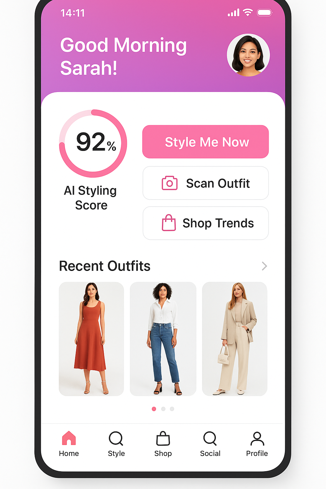

# Tanvi Vanity AI - Complete A/B Testing User Guide

## 🌟 **"We girls have no time"** - The Ultimate Digital Wardrobe & Fashion AI Experience

---

### 📱 **Welcome to the Future of Wardrobe Management**

Thank you for participating in the A/B testing of **Tanvi Vanity AI**, the revolutionary fashion app that's transforming how women manage their wardrobes, plan outfits, and make smart fashion decisions. This comprehensive guide will help you understand every aspect of the app and provide meaningful feedback that will shape the future of AI-powered wardrobe management.

---

## 🎯 **What is Tanvi Vanity AI?**

**Tanvi Vanity AI** is an intelligent digital wardrobe companion that combines artificial intelligence, computer vision, AR try-on technology, and smart wardrobe management to solve the modern woman's biggest challenge: **"We girls have no time"** for complicated outfit planning and wardrobe decisions.

### **The Core Problem We Solve:**

#### **🧥 Wardrobe Memory & Management:**
- **"What did I wear last week?"** - No memory of past outfits
- **"Do I have anything for this event?"** - Poor wardrobe visibility
- **"I have nothing to wear!"** - Despite having a full closet
- **Outfit repetition** - Wearing the same combinations repeatedly
- **Seasonal transitions** - Forgetting what clothes you own

#### **⏰ Time & Decision Challenges:**
- **Morning rush decisions** - Need outfit recommendations in seconds
- **Event planning stress** - "What should I wear to the wedding?"
- **Shopping mistakes** - Buying items that don't match existing wardrobe
- **Decision fatigue** - Too many choices, too little time

#### **👗 Styling & Visualization:**
- **Mix-and-match uncertainty** - Will these items look good together?
- **Color coordination** - What goes with what?
- **Fit visualization** - How will this look on me without trying on?
- **Style evolution** - Wanting to try new looks but unsure how

### **Our Revolutionary Solution:**

**🔮 Digital Wardrobe Memory + AI Styling + AR Try-On** = Perfect outfit decisions in under 30 seconds, with complete wardrobe visibility and smart recommendations from items you already own.

---

## 🚀 **Core Features & Workstreams Integration**

### **1. 👗 Digital Wardrobe Management (WS3 Computer Vision)**
**Your closet, digitized and organized with AI intelligence**

#### **Wardrobe Scanning & Cataloging:**
- **Photo-based cataloging**: Snap photos of clothes to build digital wardrobe
- **AI categorization**: Automatic sorting by type, color, season, occasion
- **Outfit history tracking**: "You wore this blue dress to Sarah's party last month"
- **Wear frequency analytics**: "You haven't worn this red top in 3 months"
- **Seasonal organization**: Summer/winter wardrobe management

#### **Smart Wardrobe Insights:**
- **Wardrobe gaps analysis**: "You need more business casual tops"
- **Cost-per-wear tracking**: ROI analysis of your clothing investments
- **Style pattern recognition**: "You prefer A-line dresses and fitted tops"
- **Occasion coverage**: "You have 5 party dresses but only 2 work outfits"

**Key Capabilities:**
- **Computer Vision Recognition**: 95%+ accuracy in identifying clothing items
- **Automatic Categorization**: Sorts by type, color, brand, season, occasion
- **Outfit Memory**: Complete history of what you've worn and when
- **Wardrobe Analytics**: Insights into your style patterns and preferences
- **Smart Organization**: Seasonal transitions and occasion-based grouping

### **2. 🤖 AI Style Assistant (WS2 AI Styling Engine)**
**Smart recommendations that prioritize what you already own**

#### **Primary: Existing Wardrobe Recommendations:**
- **"Perfect match found!"**: "Your navy blazer + white top + black pants"
- **Seasonal suggestions**: "Time to bring out your fall sweaters"
- **Event-specific styling**: "For the wedding, try your floral dress + nude heels"
- **Weather-appropriate**: "It's raining - your waterproof jacket + ankle boots"

#### **Secondary: Strategic Shopping Suggestions:**
- **Wardrobe gap filling**: "A white button-down would complete 8 new outfits"
- **Versatility boosters**: "This belt would work with 6 of your dresses"
- **Trend integration**: "Add this trendy bag to modernize your classic outfits"
- **Investment pieces**: "A quality blazer would elevate your entire wardrobe"

**Key Capabilities:**
- **Machine Learning Models**: Continuously learns your style preferences
- **Confidence Scoring**: 90%+ accuracy in style recommendations
- **Context Awareness**: Weather, occasion, calendar integration
- **Personal Style Profiling**: Understands your unique aesthetic
- **Trend Integration**: Balances personal style with current trends

### **3. 📱 AR Try-On & Visualization (WS3 Computer Vision)**
**See how outfits look without the hassle of changing clothes**

#### **Virtual Try-On Technology:**
- **Real-time AR overlay**: See clothes on your body using phone camera
- **Mix-and-match preview**: Combine different wardrobe items virtually
- **Color coordination check**: "Does this top match these pants?"
- **Fit simulation**: Basic fit assessment based on body measurements

#### **Quick Visualization:**
- **30-second outfit preview**: Fast visual confirmation before getting dressed
- **Multiple angle views**: Front, side, back visualization
- **Lighting simulation**: How the outfit looks in different lighting
- **Accessory integration**: Add jewelry, bags, shoes to complete the look

**Key Capabilities:**
- **Augmented Reality Engine**: Real-time clothing overlay on your body
- **3D Visualization**: Multiple angles and lighting conditions
- **Color Matching**: AI-powered color coordination analysis
- **Fit Assessment**: Basic fit evaluation based on measurements
- **Accessory Integration**: Complete look visualization with accessories

### **4. 🤝 Social Integration (WS4 Social Features)**
**Connect with fashion community and share your style journey**

#### **Community Features:**
- **Style Challenges**: Weekly themes like "Pastel Perfection" or "Work Week Chic"
- **Outfit Sharing**: Share your styled looks with the community
- **Style Inspiration**: Discover new looks from other users
- **Fashion Discussions**: Comment and engage with style posts

#### **Social Commerce:**
- **Group Shopping**: Shop together with friends for events
- **Style Voting**: Get community feedback on outfit choices
- **Trend Spotting**: See what's popular in your style community
- **Influencer Integration**: Follow fashion influencers and style experts

**Key Capabilities:**
- **Community Platform**: Connect with like-minded fashion enthusiasts
- **Social Commerce**: Shop and style with friends
- **Content Sharing**: Share outfits, get feedback, inspire others
- **Trend Discovery**: Real-time fashion trends from community
- **Engagement Features**: Likes, comments, shares, style challenges

### **5. 🛍️ Smart Shopping Integration (WS5 E-commerce)**
**Shop strategically to enhance your existing wardrobe**

#### **Wardrobe-Conscious Shopping:**
- **Gap analysis**: "Buy this to create 5 new outfits with existing pieces"
- **Versatility scoring**: "This item works with 8 pieces you already own"
- **ROI predictions**: "This blazer will give you 12 new outfit combinations"
- **Duplicate prevention**: "You already have a similar black top"

#### **AI-Generated Model Diversity:**
- **Ethical AI models**: Synthetic faces ensuring diverse, inclusive representation
- **Body type variety**: Different sizes and shapes for realistic visualization
- **Cultural representation**: Models reflecting global diversity
- **No exploitation**: AI-generated faces protect real model privacy

**Key Capabilities:**
- **Multi-Market Support**: US (USD) and India (INR) pricing
- **Merchant Integration**: Zara, H&M, Myntra, Amazon Fashion
- **Payment Processing**: Credit cards, PayPal, UPI, Cash on Delivery
- **Smart Recommendations**: AI-powered product suggestions based on wardrobe gaps
- **Price Comparison**: Best deals across multiple retailers

### **6. 👤 User Management (WS1 Integration)**
**Personalized experience with secure profile management**

#### **Profile & Preferences:**
- **Style profiling**: Personal aesthetic, body type, lifestyle preferences
- **Budget management**: Spending limits and price range preferences
- **Size & fit**: Measurements and fit preferences across brands
- **Privacy controls**: Granular control over data sharing and social features

#### **Analytics & Insights:**
- **Style evolution**: Track how your style changes over time
- **Outfit performance**: Which outfits get the most compliments
- **Shopping patterns**: Spending analysis and wardrobe ROI
- **Achievement system**: Style milestones and community recognition

**Key Capabilities:**
- **Profile Management**: Personal info, style preferences, measurements
- **Preference Learning**: AI learns from your choices and feedback
- **Style History**: Complete record of outfits and purchases
- **Achievement System**: Style milestones and community recognition
- **Privacy Controls**: Granular control over data sharing

---

## 🌍 **Multi-Market Features**

### **US Market Experience**
- **Currency**: USD pricing across all retailers
- **Brands**: Zara, H&M, Nordstrom, Target, Amazon Fashion
- **Payment**: Credit cards, PayPal, Apple Pay, Google Pay
- **Shipping**: Standard (5-7 days), Express (2-3 days), Same-day
- **Style Focus**: Professional wear, fast fashion, seasonal trends
- **Free Shipping**: Orders over $50

### **India Market Experience**
- **Currency**: INR pricing with local market rates
- **Brands**: Myntra, Flipkart Fashion, Ajio, Nykaa Fashion
- **Payment**: UPI, Paytm, Net Banking, Cash on Delivery
- **Shipping**: Standard (3-5 days), Express (1-2 days), Metro same-day
- **Style Focus**: Ethnic wear integration, festival collections, value-conscious
- **Free Shipping**: Orders over ₹999

---

## 📱 **App Interface & User Experience**

### **🏠 Home Dashboard**
**Your wardrobe command center**

#### **Quick Actions:**
- **"Style Me Now"** - Instant outfit recommendation from existing wardrobe
- **"Scan New Item"** - Add to digital wardrobe
- **"Plan Outfit"** - Future event styling
- **"Wardrobe Insights"** - Analytics and recommendations

#### **Smart Widgets:**
- **Weather-based suggestions**: "It's cold today - try your wool sweater"
- **Calendar integration**: "Client meeting at 2 PM - here's your power outfit"
- **Outfit history**: "You wore this combination last Tuesday"
- **Wardrobe stats**: "You have 47 items, 156 possible combinations"

#### **PWA Install Prompt:**

The app features a beautiful install prompt that appears after 15 seconds, encouraging users to add Tanvi AI to their home screen for a native app experience.

### **🤖 AI Style Screen**
**Your personal fashion advisor**

#### **Recommendation Engine:**
- **Confidence scoring**: "92% match for your style"
- **Reasoning explanation**: "This works because of your body type and color preferences"
- **Alternative options**: "If you don't like this, try these 3 alternatives"
- **Styling tips**: "Roll up the sleeves for a more casual look"

#### **Wardrobe-First Approach:**
- **Primary suggestions**: Outfits from items you already own
- **Mix-and-match**: "Your blue top + black pants + brown belt"
- **Occasion matching**: "Perfect for your 2 PM client meeting"
- **Weather integration**: "Great choice for today's 72°F weather"

#### **Learning System:**
- **Preference tracking**: Learns from your choices and feedback
- **Style evolution**: Adapts to changing preferences
- **Occasion memory**: Remembers what works for different events
- **Feedback integration**: Improves based on your ratings

### **📸 Camera & AR Screen**
**Digital wardrobe scanning and virtual try-on**

#### **Wardrobe Scanning Mode:**
- **Item recognition**: AI identifies clothing type, color, pattern
- **Automatic categorization**: Sorts into appropriate wardrobe sections
- **Quality assessment**: Evaluates condition and styling potential
- **Outfit suggestions**: Immediate recommendations for new items

#### **AR Try-On Mode:**
- **Real-time overlay**: See clothes on your body instantly
- **Multiple angles**: Front, side, profile views
- **Lighting adjustment**: Different lighting scenarios
- **Mix-and-match**: Combine different wardrobe items virtually

#### **Digital Wardrobe View:**
**Your closet, organized and searchable**

#### **Organization Options:**
- **By category**: Tops, bottoms, dresses, outerwear, accessories
- **By color**: Visual color palette organization
- **By season**: Summer, winter, transitional pieces
- **By occasion**: Work, casual, formal, athletic
- **By frequency**: Most worn, least worn, never worn

#### **Smart Features:**
- **Search functionality**: "Show me blue tops" or "Find my black dress"
- **Outfit combinations**: "What goes with this item?"
- **Wear tracking**: "Last worn 2 weeks ago"
- **Care instructions**: "Dry clean only" reminders

### **🛍️ Shop Screen**
**Strategic shopping to enhance your wardrobe**

#### **Wardrobe-Conscious Shopping:**
- **Gap analysis display**: "Buy this blazer to create 8 new outfits"
- **Versatility scoring**: Each item shows compatibility with existing wardrobe
- **ROI predictions**: "This investment piece works with 12 items you own"
- **Duplicate prevention**: "Similar item alert: You have a navy blazer"

#### **AI-Generated Models:**
- **Diverse representation**: Synthetic models of various ethnicities and body types
- **Ethical approach**: No real model exploitation or image rights issues
- **Inclusive sizing**: Models representing different body shapes and sizes
- **Cultural sensitivity**: Appropriate representation for global markets

#### **Smart Shopping Features:**
- **Multi-retailer comparison**: Prices across Zara, H&M, Myntra, Amazon
- **Wardrobe integration**: "This top matches 6 items in your closet"
- **Trend integration**: "Add this trendy piece to modernize your style"
- **Budget awareness**: Filters and suggestions within your price range

#### **Shopping Cart & Checkout:**
- **Wardrobe impact preview**: "Adding these 3 items creates 15 new outfits"
- **Total outfit cost**: Complete look pricing including accessories
- **Styling suggestions**: "Complete this look with shoes from your closet"
- **One-tap checkout**: Saved payment methods for quick purchasing

### **🤝 Social Screen**
**Connect with fashion community**

#### **Community Feed:**
- **Style challenges**: "Pastel Perfection Challenge - 2 days left!"
- **Outfit sharing**: Community members sharing their styled looks
- **Trend spotting**: Popular combinations and emerging trends
- **Style inspiration**: Discover new looks from similar style profiles

#### **Engagement Features:**
- **Like and comment**: Engage with community posts
- **Style voting**: Help others choose between outfit options
- **Challenge participation**: Join weekly styling challenges
- **Follow system**: Follow users with similar style aesthetic

#### **Social Commerce:**
- **Group shopping**: "Sarah and 3 friends are shopping for the wedding"
- **Style collaboration**: Get input on outfit choices
- **Trend discovery**: See what's popular in your style community
- **Influencer content**: Fashion tips from style experts

### **👤 Profile Screen**
**Your personal style journey and analytics**

#### **Style Analytics:**
- **Outfit history**: Visual timeline of your styled looks
- **Performance metrics**: Which outfits get the most compliments
- **Style evolution**: How your preferences have changed over time
- **Wardrobe utilization**: Most and least worn items

#### **Achievements & Milestones:**
- **Style streaks**: "7 days of confident outfit choices!"
- **Community recognition**: Likes, shares, and positive feedback
- **Wardrobe efficiency**: "You've worn 80% of your wardrobe this month"
- **Trend adoption**: "Early adopter of 3 major fashion trends"

#### **Settings & Preferences:**
- **Style profile**: Body type, color preferences, lifestyle
- **Budget settings**: Spending limits and price range preferences
- **Privacy controls**: Social sharing and data usage preferences
- **Notification settings**: Styling reminders and challenge alerts

---

## 🎯 **Detailed Test Scenarios**

### **Scenario 1: Morning Wardrobe Rush** ⏰
**"I'm running late and have nothing to wear!"**

#### **User Context:**
- **Time**: 7:45 AM, needs to leave by 8:00 AM
- **Occasion**: Important client presentation at work
- **Weather**: Rainy, 65°F
- **Mood**: Stressed, needs confidence boost

#### **Test Flow:**
1. **Open app** (5 seconds)
2. **Tap "Style Me Now"** button
3. **AI analyzes**: Weather + calendar + wardrobe + mood
4. **Receive recommendations**: 3 outfit options from existing wardrobe
5. **Select preferred outfit** (navy blazer + white blouse + black pants)
6. **AR preview**: Quick 10-second visualization
7. **Get dressed** with confidence

#### **Expected Outcome:**
- **Total time**: Under 30 seconds from app open to outfit decision
- **Confidence level**: High (90%+ styling accuracy)
- **Wardrobe utilization**: Uses existing items, no shopping needed
- **Weather appropriateness**: Outfit suitable for rainy day
- **Occasion match**: Professional, presentation-ready appearance

#### **Success Metrics:**
- ✅ Outfit decision made in <30 seconds
- ✅ User feels confident about the choice
- ✅ Outfit is weather and occasion appropriate
- ✅ No shopping required - uses existing wardrobe
- ✅ User leaves on time, stress-free

### **Scenario 2: Weekend Wardrobe Scan & Organization** 📸
**"Let me organize my closet and see what I actually have"**

#### **User Context:**
- **Time**: Saturday afternoon, relaxed
- **Goal**: Organize wardrobe and discover forgotten items
- **Season**: Transitioning from summer to fall
- **Motivation**: Feeling like "I have nothing to wear" despite full closet

#### **Test Flow:**
1. **Open wardrobe scanner**
2. **Photograph clothing items**: 20-30 pieces over 15 minutes
3. **AI categorization**: Automatic sorting by type, color, season
4. **Wardrobe analysis**: "You have 15 tops, 8 bottoms, 12 dresses"
5. **Gap identification**: "You need more fall transitional pieces"
6. **Outfit generation**: "Here are 25 new outfit combinations you can make"
7. **Seasonal transition**: "Pack away summer items, bring out fall pieces"

#### **Expected Outcome:**
- **Digital wardrobe created**: Complete catalog of owned items
- **Hidden gems discovered**: "I forgot I had this dress!"
- **Outfit possibilities revealed**: 25+ new combinations from existing pieces
- **Strategic shopping list**: 3-4 key pieces to maximize wardrobe potential
- **Seasonal organization**: Clear summer/fall wardrobe transition plan

#### **Success Metrics:**
- ✅ 90%+ of wardrobe successfully cataloged
- ✅ User discovers 5+ forgotten items
- ✅ 20+ new outfit combinations generated
- ✅ Clear shopping strategy for wardrobe gaps
- ✅ Seasonal transition plan created

### **Scenario 3: Social Style Challenge** 🎨
**"I want to participate in the Pastel Perfection challenge"**

#### **User Context:**
- **Challenge**: "Pastel Perfection" - create outfit using pastel colors
- **Goal**: Participate in community challenge and get engagement
- **Time**: Weekend, relaxed styling session
- **Motivation**: Connect with fashion community and try new styles

#### **Test Flow:**
1. **Navigate to Social screen**
2. **Find "Pastel Perfection" challenge**
3. **Read challenge details**: Use 2+ pastel colors, spring/summer vibe
4. **Use AI styling**: "Create pastel outfit from my wardrobe"
5. **AR try-on**: Visualize pastel combinations
6. **Select final look**: Light pink top + mint green pants + cream accessories
7. **Take photo**: Style and photograph the chosen outfit
8. **Post to community**: Share with challenge hashtag and caption
9. **Engage**: Like and comment on other participants' posts

#### **Expected Outcome:**
- **Successful challenge participation**: Outfit meets challenge criteria
- **Community engagement**: Receives likes, comments, and positive feedback
- **Style exploration**: Tries new color combinations outside comfort zone
- **Social connection**: Connects with other fashion enthusiasts
- **Confidence boost**: Positive community response builds styling confidence

#### **Success Metrics:**
- ✅ Challenge requirements met with existing wardrobe items
- ✅ Receives 10+ likes and 3+ positive comments
- ✅ User feels confident about trying new style
- ✅ Engages with other community members' posts
- ✅ Plans to participate in future challenges

### **Scenario 4: Event Planning & Outfit Coordination** 🎉
**"I have a wedding next month - what should I wear?"**

#### **User Context:**
- **Event**: Outdoor wedding, 4 PM ceremony
- **Season**: Late spring, expected 75°F
- **Dress code**: "Cocktail attire"
- **Relationship**: Close friend's wedding
- **Constraints**: Don't want to upstage bride, need to be comfortable for outdoor venue

#### **Test Flow:**
1. **Create event entry**: Wedding details, dress code, weather
2. **Wardrobe scan**: AI reviews existing formal wear
3. **Appropriate options**: "Your blue midi dress is perfect for cocktail attire"
4. **Styling suggestions**: "Add nude heels + delicate jewelry"
5. **AR try-on**: Visualize complete look
6. **Weather check**: "Bring a light cardigan for evening"
7. **Final confirmation**: Save outfit plan for the event
8. **Reminder setup**: "Outfit planned for Sarah's wedding - May 15th"

#### **Expected Outcome:**
- **Perfect outfit planned**: Appropriate for dress code and venue
- **Confidence in choice**: No last-minute outfit panic
- **Weather preparedness**: Backup plan for temperature changes
- **Respectful styling**: Appropriate for wedding guest role
- **Complete look**: Outfit, shoes, accessories, backup items

#### **Success Metrics:**
- ✅ Outfit meets dress code requirements
- ✅ Weather and venue appropriate
- ✅ User feels confident and comfortable
- ✅ Respectful of wedding context
- ✅ Complete styling including accessories

### **Scenario 5: Multi-Market Shopping Comparison** 🌍
**"I need professional outfits - compare US vs India options"**

#### **User Context:**
- **Need**: Professional wardrobe upgrade for new job
- **Budget**: $200 USD / ₹15,000 INR equivalent
- **Style**: Business casual to business formal
- **Timeline**: Need outfits within 2 weeks

#### **Test Flow (US User):**
1. **Set shopping goal**: "Professional wardrobe upgrade"
2. **Budget input**: $200 maximum
3. **AI recommendations**: Blazer + 2 tops + pants from Zara, H&M
4. **Price comparison**: Compare across retailers
5. **Wardrobe integration**: "These create 8 new professional outfits"
6. **Payment**: Credit card checkout
7. **Shipping**: Express 2-day delivery

#### **Test Flow (India User):**
1. **Set shopping goal**: "Professional wardrobe upgrade"
2. **Budget input**: ₹15,000 maximum
3. **AI recommendations**: Blazer + kurta + formal pants from Myntra, Ajio
4. **Cultural balance**: Mix of western and Indo-western pieces
5. **Price comparison**: Compare across Indian retailers
6. **Payment**: UPI payment method
7. **Shipping**: Standard delivery with COD option

#### **Expected Outcome:**
- **Market-appropriate recommendations**: Culturally and professionally suitable
- **Budget optimization**: Maximum value within spending limit
- **Cultural sensitivity**: Appropriate for local business culture
- **Quality selections**: Professional appearance and durability
- **Wardrobe multiplication**: Creates multiple outfit combinations

#### **Success Metrics:**
- ✅ Recommendations appropriate for local business culture
- ✅ Budget utilized efficiently for maximum impact
- ✅ Creates 8+ professional outfit combinations
- ✅ Payment and shipping methods work smoothly
- ✅ User satisfaction with cultural appropriateness

### **Scenario 6: Wardrobe ROI & Analytics** 📊
**"Show me how to get more value from my existing wardrobe"**

#### **User Context:**
- **Goal**: Maximize wardrobe potential and reduce shopping waste
- **Current issue**: Feels like she has "nothing to wear" despite full closet
- **Interest**: Understanding style patterns and wardrobe efficiency
- **Motivation**: More sustainable and cost-effective fashion choices

#### **Test Flow:**
1. **Navigate to Profile Analytics**
2. **Review wardrobe stats**: "47 items, 156 possible combinations"
3. **Wear frequency analysis**: "You've only worn 60% of your wardrobe"
4. **Cost-per-wear tracking**: "Your black blazer: $3.50 per wear (excellent ROI)"
5. **Gap analysis**: "A white button-down would create 12 new outfits"
6. **Style pattern recognition**: "You prefer A-line silhouettes and jewel tones"
7. **Shopping recommendations**: 3 strategic pieces to maximize wardrobe
8. **Seasonal planning**: "Transition 8 summer pieces to fall styling"

#### **Expected Outcome:**
- **Wardrobe insights**: Clear understanding of style patterns and preferences
- **Efficiency improvement**: Plan to wear underutilized items
- **Strategic shopping**: Focused list of high-impact purchases
- **Cost awareness**: Understanding of clothing investment ROI
- **Sustainable choices**: Reduced waste and more thoughtful consumption

#### **Success Metrics:**
- ✅ User discovers 5+ underutilized wardrobe items
- ✅ Clear understanding of personal style patterns
- ✅ Strategic shopping list of 3 high-impact items
- ✅ Increased wardrobe utilization over following weeks
- ✅ Improved satisfaction with existing wardrobe

---

## 🧪 **A/B Testing Objectives**

### **Primary Goals**
1. **Wardrobe Management Validation**: How useful is the digital wardrobe feature?
2. **AI Recommendation Accuracy**: Are wardrobe-first suggestions relevant and helpful?
3. **AR Try-On Effectiveness**: Does virtual try-on improve outfit decisions?
4. **Speed & Efficiency**: Can users make outfit decisions in under 30 seconds?
5. **PWA Experience**: How well does the PWA installation and usage work?

### **Secondary Goals**
1. **Social Engagement**: Do users participate in community features and challenges?
2. **Strategic Shopping**: Do users make more thoughtful, wardrobe-conscious purchases?
3. **Retention Patterns**: How often do users return for wardrobe management?
4. **Cross-Feature Usage**: Do users utilize multiple app features together?
5. **Market Preferences**: Differences between US and India user behavior

### **Feature-Specific Testing**

#### **Digital Wardrobe Management:**
- **Cataloging accuracy**: How well does AI categorize clothing items?
- **Organization usefulness**: Is the wardrobe organization helpful for daily use?
- **Outfit discovery**: Do users find new combinations from existing pieces?
- **Wear tracking**: Is the outfit history feature valuable?

#### **AR Try-On Technology:**
- **Visual accuracy**: How realistic does the virtual try-on look?
- **Decision improvement**: Does AR help make better outfit choices?
- **Performance**: How smooth is the AR experience across devices?
- **Adoption**: Do users regularly use AR for outfit planning?

#### **AI Styling (Wardrobe-First):**
- **Relevance**: Are existing wardrobe recommendations appropriate?
- **Creativity**: Does AI suggest combinations users wouldn't think of?
- **Occasion matching**: Are suggestions suitable for planned activities?
- **Learning**: Does the AI improve recommendations over time?

---

## 📊 **Feedback Framework**

### **Rating Categories**

#### **1. Core Feature Effectiveness (1-5 stars)**
- **Digital Wardrobe Management**: How useful is wardrobe cataloging and organization?
- **AR Try-On Technology**: How accurate and helpful is virtual try-on?
- **AI Styling (Wardrobe-First)**: How relevant are outfit suggestions from existing items?
- **Event Planning**: How well does it help with occasion-specific styling?
- **Strategic Shopping**: How helpful are wardrobe-conscious shopping suggestions?

#### **2. User Experience (1-5 stars)**
- **Speed & Efficiency**: How quickly can you accomplish styling goals?
- **Interface Design**: How intuitive and appealing is the app interface?
- **Learning Capability**: How well does the app adapt to your preferences?
- **Problem Solving**: How effectively does it solve your fashion challenges?
- **Overall Satisfaction**: How likely are you to recommend this app?

#### **3. Specific Feedback Questions**

**Digital Wardrobe:**
- How accurate was the AI categorization of your clothing items?
- Did wardrobe organization help you discover forgotten pieces?
- How useful was the outfit history and wear tracking?
- Did you find new outfit combinations from existing items?

**AR Try-On:**
- How realistic did the virtual try-on look on your body?
- Did AR help you make better outfit decisions without changing clothes?
- What lighting conditions worked best/worst for AR?
- How often did you use AR for outfit planning?

**AI Recommendations (Wardrobe-First):**
- How often did you like AI suggestions from your existing wardrobe?
- Did recommendations help you wear underutilized items?
- Were suggestions appropriate for your occasions and weather?
- How well did the AI learn your style preferences over time?

**Morning Rush Scenario:**
- Could you get good outfit recommendations in under 30 seconds?
- Did quick styling from existing wardrobe reduce morning stress?
- Were fast recommendations still high quality and appropriate?
- How often did you need to shop vs. use existing items?

**Event Planning:**
- How helpful was the app for planning special occasion outfits?
- Did it help you choose appropriate outfits from existing wardrobe?
- Could you plan outfits effectively in advance?
- Did outfit reminders and planning features work well?

**Strategic Shopping:**
- Did shopping suggestions truly fill gaps in your wardrobe?
- Were versatility predictions accurate (did new items work with existing pieces)?
- Did the app help prevent duplicate or unnecessary purchases?
- How well did it balance shopping suggestions with wardrobe utilization?

### **4. Open-Ended Feedback**

**What We Want to Know:**
- **Biggest surprise**: What feature exceeded your expectations?
- **Most valuable**: Which feature provided the most value in your daily routine?
- **Missing features**: What wardrobe management functionality do you wish existed?
- **Behavior change**: How did the app change your approach to getting dressed?
- **Wardrobe insights**: What did you learn about your existing wardrobe?
- **Shopping impact**: How did it affect your shopping decisions and habits?

**Specific Scenarios:**
- **Best wardrobe moment**: When did the app perfectly solve a wardrobe challenge?
- **AR success story**: Describe a time when virtual try-on was particularly helpful
- **Style discovery**: Did you discover new outfit combinations you love?
- **Time savings**: How much time does the app save in your daily routine?

---

## 🔧 **Technical Testing**

### **Performance Testing**
- **App loading speed**: How quickly does the app start up?
- **Wardrobe scanning**: How fast does AI process and categorize clothing photos?
- **AR performance**: How smooth is the augmented reality experience?
- **Recommendation speed**: How quickly do outfit suggestions appear?
- **Offline functionality**: What works without internet connection?

### **Device Compatibility**
- **Camera quality**: How does wardrobe scanning work with different cameras?
- **AR performance**: How well does virtual try-on work across devices?
- **Screen sizes**: How does the interface adapt to different screen sizes?
- **Processing power**: How does performance vary with device capabilities?
- **Storage requirements**: How much phone storage does the wardrobe catalog use?

### **PWA Functionality**
- **Installation process**: How easy is it to install the PWA from browser?
- **Home screen integration**: Does the app icon and launch work properly?
- **Offline wardrobe access**: Can you browse your digital wardrobe offline?
- **Push notifications**: Do styling reminders and outfit suggestions work?
- **Update process**: How seamlessly do app updates install?

---

## 🎉 **Success Metrics & Goals**

### **Primary Success Metrics**

#### **Wardrobe Management:**
- **Cataloging adoption**: 80%+ of users scan and organize their wardrobe
- **Outfit discovery**: 70%+ find new combinations from existing items
- **Wardrobe utilization**: 60%+ increase in wearing underutilized items
- **Organization satisfaction**: 85%+ find digital wardrobe organization helpful

#### **Speed & Efficiency:**
- **Quick styling**: 80%+ get outfit recommendations in <30 seconds
- **Morning routine**: 75%+ report reduced morning outfit stress
- **Decision confidence**: 85%+ feel confident about AI recommendations
- **Time savings**: Average 15+ minutes saved per day on outfit decisions

#### **AR Try-On Effectiveness:**
- **Usage adoption**: 70%+ regularly use AR for outfit visualization
- **Decision improvement**: 80%+ feel AR helps make better outfit choices
- **Accuracy satisfaction**: 75%+ find AR visualization realistic and helpful
- **Purchase confidence**: 85%+ more confident in clothing purchases after AR try-on

### **Secondary Success Metrics**

#### **Feature Integration:**
- **Multi-feature usage**: 80%+ use 3+ core features regularly
- **Workflow efficiency**: 75%+ find the app faster than their previous process
- **Learning effectiveness**: 70%+ notice improvement in recommendations over time
- **Event planning**: 85%+ successfully plan outfits for special occasions

#### **Social & Community:**
- **Challenge participation**: 60%+ participate in at least one style challenge
- **Community engagement**: 70%+ engage with social features (likes, comments)
- **Style sharing**: 50%+ share outfits with the community
- **Inspiration discovery**: 80%+ find style inspiration from community

#### **Strategic Shopping:**
- **Wardrobe-conscious purchases**: 75%+ consider wardrobe integration before buying
- **Purchase satisfaction**: 90%+ satisfied with items bought through app recommendations
- **Duplicate prevention**: 80%+ avoid buying similar items they already own
- **ROI improvement**: 70%+ report better cost-per-wear on new purchases

### **Market-Specific Goals**

#### **US Market:**
- **Professional styling**: 85%+ satisfaction with work outfit recommendations
- **Seasonal adaptation**: 80%+ find seasonal wardrobe transitions helpful
- **Brand integration**: 70%+ find US retailer suggestions relevant and accessible
- **Lifestyle matching**: 75%+ feel the app understands American work/social culture

#### **India Market:**
- **Cultural sensitivity**: 90%+ find traditional styling appropriate and respectful
- **Ethnic wear integration**: 85%+ satisfaction with ethnic wear recommendations
- **Festival planning**: 80%+ successfully plan outfits for cultural celebrations
- **Local relevance**: 75%+ find local brand suggestions accessible and relevant

---

## 🚀 **Getting Started with Testing**

### **Phase 1: Setup & Digital Wardrobe Creation (Week 1)**
1. **Install the PWA** from the provided URL
2. **Complete profile setup** with style preferences, measurements, and budget
3. **Scan 15-20 wardrobe items** to build initial digital wardrobe
4. **Try AR try-on** with 5+ different items and combinations
5. **Get first AI recommendations** from existing wardrobe and rate them
6. **Explore wardrobe organization** and categorization features

### **Phase 2: Daily Usage & Routine Integration (Weeks 2-3)**
1. **Use morning styling feature** for 7+ days to test quick outfit decisions
2. **Plan outfits for 2-3 upcoming events** using existing wardrobe
3. **Scan additional wardrobe items** (aim for 30+ total for comprehensive testing)
4. **Try AR try-on** for daily outfit planning and decision-making
5. **Engage with social features** - participate in one style challenge
6. **Use strategic shopping** - browse recommendations but purchase optional

### **Phase 3: Advanced Features & Integration (Week 4)**
1. **Explore wardrobe analytics** and style insights
2. **Test seasonal transition features** (organize summer/fall items)
3. **Try cultural/market-specific features** (US professional or India traditional styling)
4. **Use event planning** for a real upcoming occasion
5. **Test cross-feature integration** (wardrobe + AR + social + shopping)
6. **Evaluate learning and adaptation** of AI recommendations

### **Phase 4: Comprehensive Feedback (Week 5)**
1. **Complete detailed feedback survey** covering all features
2. **Participate in user interview** (if selected)
3. **Test any updated features** based on early feedback
4. **Provide final recommendations** for improvements
5. **Share overall experience** and likelihood to recommend
6. **Document behavior changes** and routine integration

---

## 📞 **Support & Contact**

### **Technical Support**
- **App issues**: Report bugs, crashes, or technical problems
- **Feature questions**: Get help understanding how features work
- **Account problems**: Assistance with profile, wardrobe data, or sync issues
- **Performance issues**: Help with slow loading, AR problems, or device compatibility

### **Feedback Channels**
- **In-app feedback**: Rate features and leave comments directly in the app
- **Email feedback**: Send detailed feedback, suggestions, and bug reports
- **User interviews**: Participate in one-on-one feedback sessions
- **Group discussions**: Join other testers for collaborative feedback sessions

### **Resources**
- **Video tutorials**: Learn how to use advanced features like AR try-on and wardrobe scanning
- **FAQ**: Common questions about wardrobe management, AI recommendations, and app features
- **Best practices**: Tips for getting the most out of wardrobe cataloging and organization
- **Community**: Connect with other testers and share wardrobe management experiences

---

## 🌟 **Thank You for Testing!**

Your participation in this A/B testing program is invaluable to the development of Tanvi Vanity AI. Every piece of feedback about wardrobe management, every rating of AI recommendations, and every suggestion about AR try-on helps us create a better product that truly solves the fashion challenges faced by women around the world.

Together, we're building the future of wardrobe technology - one that respects your time, remembers your clothes, understands your style, and empowers you to look and feel your best every day using what you already own.

**"We girls have no time"** - and with your help, we're making sure you'll never need time for wardrobe stress again! Your digital closet will remember everything, AI will suggest perfect combinations, and AR will show you how great you'll look - all in under 30 seconds.

---

*This guide represents the current state of Tanvi Vanity AI as of the A/B testing phase. Features and functionality may evolve based on user feedback and testing results.*

